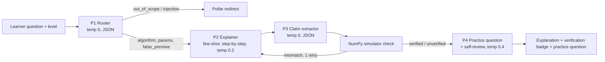
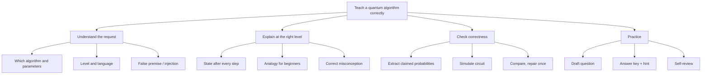
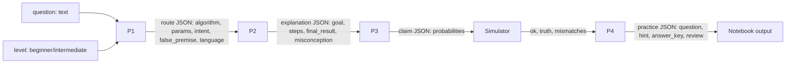
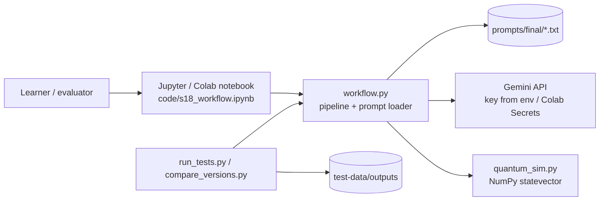

# Diagrams (Mermaid; GitHub renders these. Screenshot them for the PDF.)

## 1. Prompt workflow

```mermaid
flowchart LR
    Q[Learner question + level] --> P1[P1 Router<br/>temp 0, JSON]
    P1 -->|out_of_scope / injection| R[Polite redirect]
    P1 -->|algorithm, params, false_premise| P2[P2 Explainer<br/>few-shot, step-by-step, temp 0.2]
    P2 --> P3[P3 Claim extractor<br/>temp 0, JSON]
    P3 --> S[NumPy simulator check]
    S -->|mismatch, 1 retry| P2
    S -->|verified / unverified| P4[P4 Practice question<br/>+ self-review, temp 0.4]
    P4 --> O[Explanation + verification badge + practice question]
```

## 2. Task decomposition

```mermaid
flowchart TB
    T[Teach a quantum algorithm correctly] --> A[Understand the request]
    T --> B[Explain at the right level]
    T --> C[Check correctness]
    T --> D[Practice]
    A --> A1[Which algorithm and parameters] & A2[Level and language] & A3[False premise / injection]
    B --> B1[State after every step] & B2[Analogy for beginners] & B3[Correct misconception]
    C --> C1[Extract claimed probabilities] & C2[Simulate circuit] & C3[Compare, repair once]
    D --> D1[Draft question] & D2[Answer key + hint] & D3[Self-review]
```

## 3. Input-output flow

```mermaid
flowchart LR
    I1[question: text] --> P1
    I2[level: beginner/intermediate] --> P1
    P1 -->|route JSON: algorithm, params, intent, false_premise, language| P2
    P2 -->|explanation JSON: goal, steps, final_result, misconception| P3
    P3 -->|claim JSON: probabilities| SIM[Simulator]
    SIM -->|ok, truth, mismatches| P4
    P4 -->|practice JSON: question, hint, answer_key, review| OUT[Notebook output]
```

## 4. System architecture

```mermaid
flowchart LR
    U[Learner / evaluator] --> NB[Jupyter / Colab notebook<br/>code/s18_workflow.ipynb]
    NB --> WF[workflow.py<br/>pipeline + prompt loader]
    WF --> PR[(prompts/final/*.txt)]
    WF --> API[Gemini API<br/>key from env / Colab Secrets]
    WF --> SIM[quantum_sim.py<br/>NumPy statevector]
    RT[run_tests.py / compare_versions.py] --> WF
    RT --> TD[(test-data/outputs)]
```
